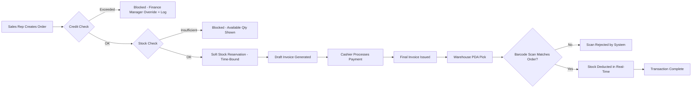
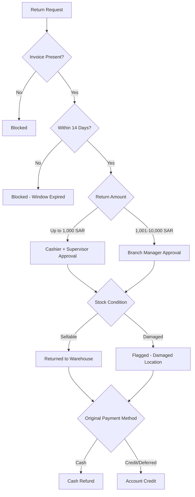
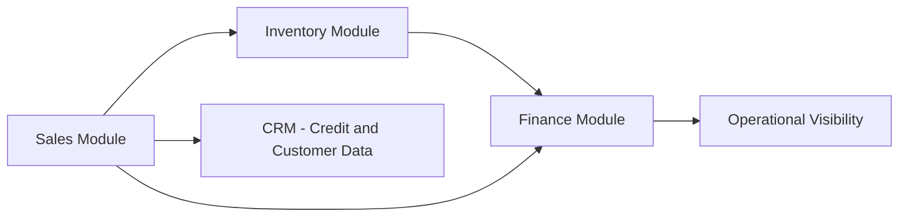
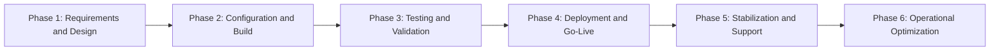
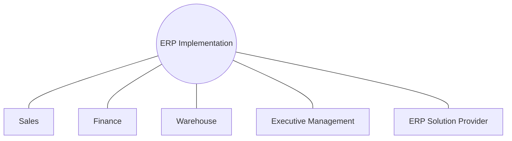

# Multi-Branch ERP Implementation

---

## Overview

Business-side coordination and delivery of a full ERP transformation across seven branches, replacing a custom in-house system that functioned only as an invoicing recorder with no operational control logic. The implementation covered seven functional modules, 150+ users, and included the design and enforcement of company-wide order, inventory, and credit control rules that did not exist in the prior system.

---

## Business Context

The organization operated a custom, in-house ERP across seven branches that had never been designed for operational control it recorded invoices but did not enforce stock deduction, reservation, credit limits, or approval governance. This gap had already been quantified and diagnosed in the preceding Inventory Gap Analysis engagement (see: Inventory Gap Analysis & ERP Readiness), which established the business case for replacing the system entirely.

---

## Business Problem

The prior system's absence of operational control created six confirmed failure conditions: no real time inventory synchronization, no stock reservation logic, no negative-stock prevention, no credit limit enforcement, no approval governance with audit trail, and no reliable financial reporting. These failures directly matched the root causes identified in the earlier gap analysis and required a full system replacement, not a patch.

---

## Objectives

- Replace the legacy system with a fully integrated ERP covering finance, inventory, sales, purchasing, HR, CRM, and POS.
- Eliminate phantom inventory and enforce real-time stock accuracy.
- Stop negative-stock selling and enforce credit limits automatically.
- Digitize the wholesale order fulfillment journey.
- Establish structured procurement and returns governance with a full audit trail.

---

## Project Scope

- 7 branches, 150+ users.
- 7 ERP functional modules: Finance, Inventory, Sales, Purchasing, CRM, HR, POS.
- 10,000+ SKUs migrated.
- Company-wide order, inventory, and credit control business rules — not limited to a single branch type.

---

## My Role

**Title:** Business Systems Analyst
**Company:** Mohd. Saeed Balbid Company
**Duration:** Sep 2023 – Nov 2025

Served as the primary Business Systems Analyst supporting the business-side implementation of the ERP across seven branches coordinating business analysis activities, implementation readiness, stakeholder collaboration, and operational process standardization from requirements through stabilization.

---

## Phase 1 — Requirements & Design

**Stakeholders:** Sales, Finance, Warehouse, Executive Management.

Requirements were gathered directly from these functions and translated into business requirements that had to be built into the new ERP, since none of the following existed in the prior system:

- **Branch-type pricing** distinct price lists for wholesale, supermarket, and mini-market branches.
- **Central and branch-level warehousing** inventory managed both centrally and per branch, with transfers tracked between them.
- **Batch and expiry tracking** a capability entirely absent from the legacy system.
- **Structured purchasing workflow** including supplier quotation comparison ahead of purchase order issuance.

Requirements and functional specifications were formally documented as a Business Requirements Document (BRD) and functional requirements, forming the basis for vendor configuration and later UAT acceptance criteria.

---

## Phase 2 — Configuration & Build

Module configuration covered all seven functional areas. Within this phase, the company-wide order and inventory business rules were designed and built — rules gathered directly from stakeholders and confirmed as net-new requirements, since none existed in the prior system.

### Business Rules & Order Lifecycle Logic

**Order and stock control rules:**
- **Hard stock block** an order cannot be created if requested quantity exceeds available stock; the system returns the actual available quantity instead of allowing the order to proceed.
- **Credit limit check** an order is blocked at the point of sale if the customer's outstanding balance exceeds their approved credit limit; override requires Finance Manager approval with a mandatory logged reason.
- **Soft stock reservation** confirmed stock is reserved against a draft order for a defined hold period; if not converted to a confirmed order within that window, the reservation is automatically released back to the available pool, or can be manually released by a supervisor with a mandatory reason code and immutable log entry.
- **Deduction at pick confirmation** physical stock is deducted only once a warehouse pick is confirmed via barcode scan, not at order creation, keeping system and physical stock aligned.
- **Absolute negative-stock prevention** a transaction that would drive available stock below zero is rejected at the system level; override requires CFO-level approval, logged and timestamped.

**Order approval governance:**
Order approval is enforced through system checks rather than a manual sign-off chain credit-limit override requires Finance Manager approval, reservation release beyond auto-expiry requires supervisor approval with a mandatory reason code, and negative-stock override requires CFO approval. Each override path is logged immutably.

**Returns approval workflow:**
Returns require the original invoice and must fall within a 14-day window from invoice date. Return amounts up to 1,000 SAR require cashier initiation with supervisor approval; amounts from 1,001–10,000 SAR require branch manager approval. Refund method follows the original payment method — cash refund for cash payments, account credit for deferred/credit payments. Returned stock is classified as sellable (returned to warehouse) or damaged (flagged to a separate location). Every return event is logged immutably.

**Order lifecycle:** Sales representative creates an order (including large orders of 100+ line items) → draft invoice generated → cashier processes payment → final invoice issued → warehouse picks and confirms via PDA barcode scan against the order. This flow was confirmed as the order lifecycle actually implemented in the new ERP.

---

## Phase 3 — Testing & Validation

UAT was conducted across the core order, inventory, and credit control workflows prior to go-live, directly validating the business rules designed in Phase 2 against the gaps identified during the earlier diagnostic engagement:

- **Credit limit validation:** UAT confirmed the prior system had no per-customer credit limit assignment — users had to manually search each customer, generate an aging report, and review outstanding balances before deciding whether to proceed, with no automated alert for credit-limit breach or overdue terms. This finding directly validated the need for the automated credit check built in Phase 2.
- **Soft stock reservation:** UAT confirmed the prior system did not reserve inventory or display available quantity at order creation, meaning orders could be entered with no visibility into actual stock. The new system's time-bound reservation and real-time availability display were validated against this gap.
- **Batch/expiry tracking:** UAT confirmed the prior system had no batch tracking capability. The new process — recording expiry dates via barcode scan at goods receipt, enabling expiry-based rotation instead of random handling, with alerts generated six months ahead of expiry — was validated during this phase.
- **Pricing:** UAT confirmed correct application of branch-type price lists (wholesale, supermarket, mini-market) at order entry. Customer-segment pricing tiers were out of scope for this project — that capability belongs to the later B2B E-commerce platform, not this ERP implementation.

**Defect tracking:** Defects identified during UAT were tracked through a ticketing system, combined with direct communication with the ERP solution provider for resolution.

---

## Phase 4 — Deployment & Go-Live

Go-live surfaced operational issues consistent with a large-scale system transition:

- System delays when entering large orders (100+ line items).
- User errors, primarily attributable to users adapting to the new system and limited prior experience with it — not system defects.
- Bottlenecks at the handoff points between sales, cashier, and warehouse functions during the initial rollout period.

Go-live activities included master data migration coordination (10,000+ SKUs) and go-live support across all seven branches.

---

## Phase 5 — Stabilization & Support

Following go-live, stabilization focused on enforcing the designed process rather than allowing manual shortcuts to persist:

- Enforced the Sales → Cashier → Warehouse flow as the single path for order fulfillment, closing off informal workarounds that had carried over from the legacy process.
- Mandated barcode scanning at pick confirmation, with the system rejecting scans of the wrong item or quantity — directly enforcing the deduction and stock accuracy rules designed in Phase 2.

**My role during this phase:** On-site support and coordination with the ERP solution provider (Hypercare).

---

## Phase 6 — Operational Optimization

Following stabilization, day-to-day ownership of Inventory Control and Finance & Operational Alignment activities was transferred to the respective department owners in Inventory and Finance. My role shifted to performance monitoring and cross-department coordination rather than direct ownership of these areas going forward.

---

## Visual Documentation

*Diagrams below reflect only rules, flows, and roles confirmed in this dossier's Evidence Mapping.*

### Business Process Flow — TO-BE Order Lifecycle

### Business Rule Decision Flow — Returns Approval Workflow

### ERP Functional Flow

### Implementation Phase Sequence

*Reflects confirmed phase order only — no specific dates are documented and none are shown.*

### Stakeholder Map

### Process Ownership Matrix — Post-Stabilization

| Area | During Implementation | Post-Stabilization Owner |
|---|---|---|
| Inventory Control | Coordinated by Business Systems Analyst | Inventory Department |
| Finance & Operational Alignment | Coordinated by Business Systems Analyst | Finance Department |
| Cross-Department Monitoring | — | Business Systems Analyst (ongoing) |

### Before vs. After — Order & Credit Control (from UAT Findings)

| Capability | AS-IS (Prior System) | TO-BE (New ERP) |
|---|---|---|
| Credit Control | Manual customer search + aging report review, no alerts | Automated credit limit check, Finance Manager override with log |
| Stock Visibility at Order Entry | No reservation, no availability shown | Real-time availability display, time-bound reservation |
| Batch / Expiry Tracking | Not supported | Barcode-scanned goods receipt, expiry recorded, 6-month advance alert |

---

## Business Outcomes

- Supported successful ERP deployment across all seven branches.
- Standardized key business processes across Finance, Inventory, Sales, Purchasing, CRM, HR, and POS.
- Improved operational visibility across branches and improved alignment between business and IT.
- Company-wide enforcement of credit limits, stock reservation, and negative-stock prevention — control mechanisms that did not exist in the prior system.
- Transaction processing speed and barcode-based pick accuracy improved substantially following implementation, consistent with the project's original objectives. These results were not validated through a formal post-implementation audit.

---

## Skills Demonstrated

- ERP Implementation Coordination
- Business Requirements Documentation (BRD) and Functional Requirements authoring
- Business Rules Design (credit control, stock reservation, approval governance)
- UAT Coordination and Defect Management
- Master Data Migration Coordination
- Go-Live Support and Hypercare Coordination
- Vendor Coordination
- Cross-functional Stakeholder Management (Sales, Finance, Warehouse, Executive Management)

---
